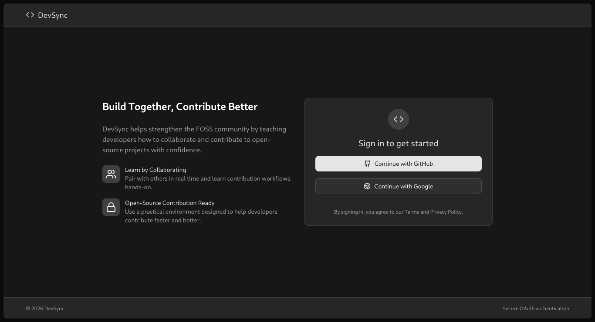
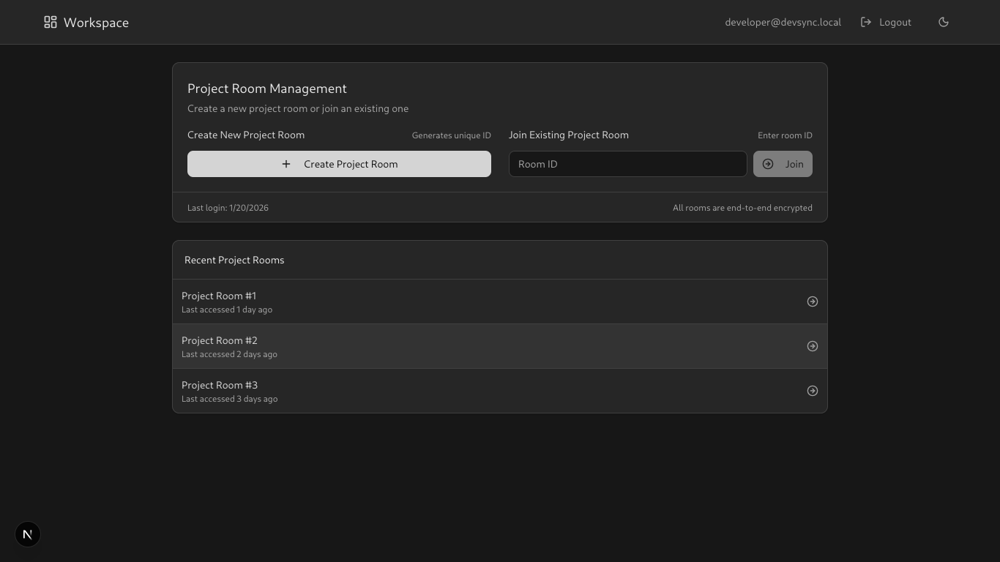
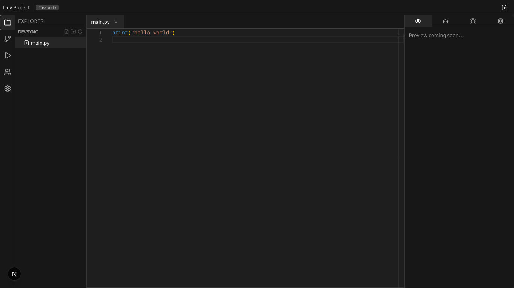

# DevSync

DevSync is a real-time collaborative workspace for people learning how to contribute to open source.

**Build Together, Contribute Better.**

The main purpose of this project is to help developers contribute to FOSS with confidence by learning collaboration workflows in a practical environment.

Instead of jumping across many tools, DevSync keeps the contribution loop in one place: discuss, edit, review, and iterate together.

## Who this is for

DevSync is for:

- first-time open-source contributors
- students and self-learners
- mentors helping others contribute
- teams running collaborative coding sessions

If you have ever thought “I want to contribute, but I don’t know where to start,” this project is built for you.

## Why DevSync

Contributing to open source is often hard because the workflow is unclear, not because the code is impossible.
DevSync helps make that workflow visible and learnable.

- Learn by collaborating in real time
- Understand contribution flow by doing it
- Build confidence before opening real project PRs

## What you can do with DevSync

- Room-based collaboration for project teams
- Shared editor and file tree state (Yjs + Socket.IO)
- Presence and teammate visibility
- In-room AI chat, review, and codebase insights
- Remote run/terminal output panel
- OAuth-based sign-in flow

## Start here (new contributors)

1. Sign in and join a room
2. Pick a small task with a mentor or teammate
3. Discuss the file structure together
4. Make and review a small change
5. Repeat until contribution flow feels natural

## Screenshots

These are placeholder paths. Replace them with actual screenshots before publishing.

### 1) Landing / Auth Experience


### 3) DashBoard


### 2) Collaborative Room Workspace



## Stack

- Next.js (App Router)
- TypeScript + React
- NextAuth (OAuth)
- Socket.IO client
- Yjs for collaborative editing
- Zustand for state management

## Security notes

Recent hardening includes:

- Protected private routes and AI APIs on the server side
- Added auth checks for sensitive handlers
- Added origin validation for state-changing requests
- Added rate limits on AI endpoints
- Added secure headers (CSP, HSTS, frame/mime/referrer protections)
- Upgraded dependencies and resolved known audit issues

## Getting started

```bash
cd devsync
npm install
npm run dev
```

Open `http://localhost:3000`.

## Environment variables

Create `.env.local` with:

- `NEXT_PUBLIC_BACKEND_URL`
- `NEXT_PUBLIC_APP_URL`
- `NEXTAUTH_URL`
- `NEXTAUTH_SECRET`
- `GITHUB_CLIENT_ID`
- `GITHUB_CLIENT_SECRET`
- `GOOGLE_CLIENT_ID`
- `GOOGLE_CLIENT_SECRET`
- `WISDOM_URL`
- `WISDOM_API_KEY`

## Project layout

- `app/` - pages, layouts, API routes
- `features/` - domain modules
- `components/`, `ui/` - reusable UI building blocks
- `lib/` - shared utilities and security helpers
- `docs/` - diagrams and project notes

## Contributing

Contributions are welcome.  
Please open an issue first for bug reports, feature requests, or docs improvements, then open a focused PR.

If you are new to open source, documentation and UI polish contributions are great first PRs.
